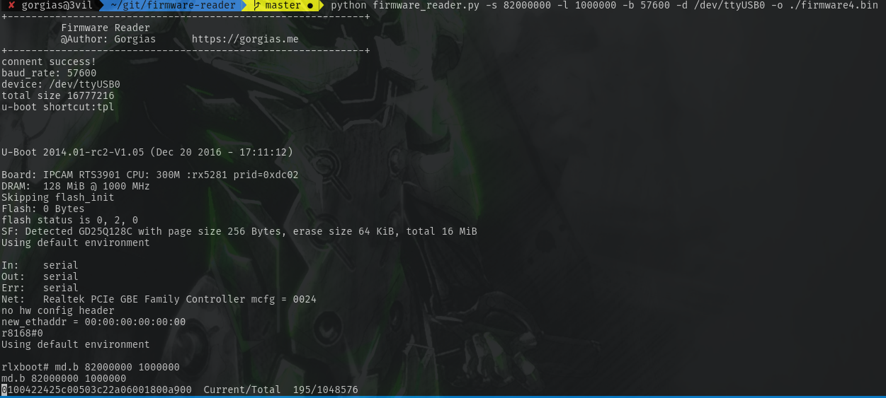
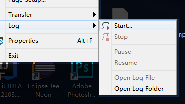

# firmware-reader
## Introduction
Reading the firmware in memory via UART interface with U-boot.


## Usage
```
git clone https://github.com/gorgiaxx/firmware-reader
```
### Online reading via UART
Step 1: Connect the UART interface to your computer USB interface.  
Step 2: Running the script and input the shortcut code(for entering U-boot mode if exist).  
Step 3: Power on your device. Waiting for memory dump to finish.  
```
-s: base address
-l: data length
-b: baud rate
-d: device
-o: output binary file path
```
### Sample
```
python firmware_reader.py -s 82000000 -l 1000000 -b 57600 -d /dev/ttyUSB0 -o ./firmware.bin
```

### Convert console logs file into a binary file

```
-i: input logs file path
-o: output binary file path
```
### Sample
```
python firmware_reader.py -i ./hex.txt -o ./firmware.bin
```
